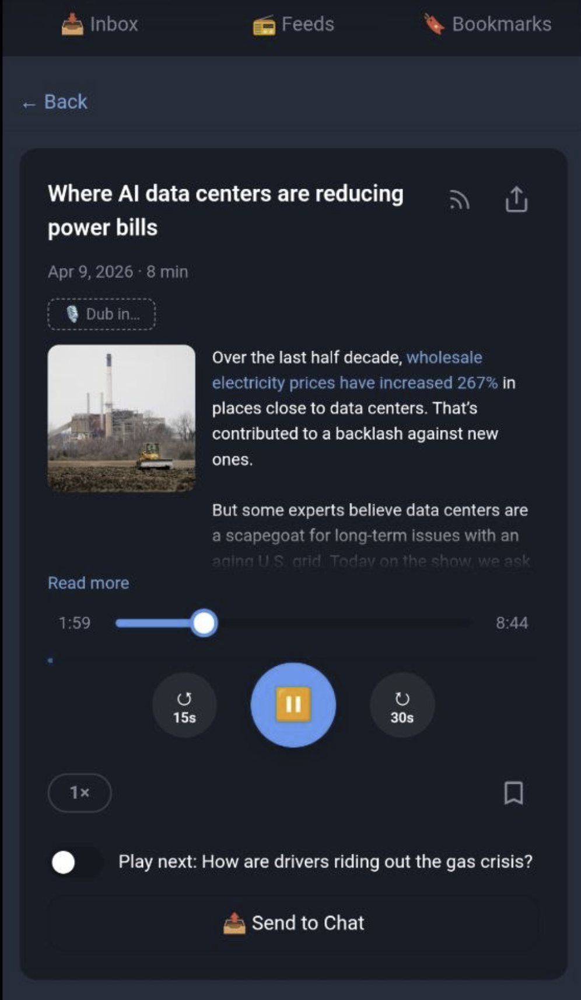

# Buzz-Bot

**Podcast player for the AI epoch.** (Click image to view youtube demo)

<a href="https://youtu.be/RsF0nrvOC88">
   
</a>


Listen to any podcast, then tap one button and hear it in your language — same voices, different words. Buzz-Bot runs inside Telegram as a Mini App and uses a cloud GPU pipeline (RunPod Serverless) to transcribe, translate, and re-synthesize every speaker's voice.
To view AI pipeline for podcast dubbing workflow check this [repository](https://github.com/watchcat/dub-pipeline)
## Features

- **RSS subscriptions** — add any podcast by RSS URL; bulk-import via OPML
- **Podcast search** — search the Apple Podcasts directory and subscribe in one tap
- **Episode inbox** — unified feed of unheard episodes across all subscriptions, with "hide listened" and compact grouping filters
- **Episode player** — native audio playback inside Telegram with resume-from-position, variable speed (1×/1.5×/2×), ±15/30 s skip, and a persistent mini-player visible on every screen
- **Autoplay** — automatically advance to the next episode when one finishes
- **Progress tracking** — listening position saved every 5 seconds; offline saves queued and replayed on reconnect
- **Offline caching** — episode audio is downloaded in the background; player seamlessly switches to the local copy on network loss; progress bar shows cached vs. listened portion in two colours
- **Bookmarks** — bookmark episodes with a single tap; search saved episodes
- **Collaborative filtering recommendations** — surface episodes liked by users with similar taste
- **Share & send** — share any episode via Telegram's share sheet, or send the audio file directly to your own chat
- **AI dubbing** — hear any podcast in your language with the original speaker's voice cloned (see below)
- **Karaoke subtitles** — CC button reveals a live subtitle panel with karaoke-style cue highlighting; tap "Transcript ↓" for a fullscreen scrollable transcript; tap any line to seek

## AI Dubbing

The centrepiece feature. Tap **🎙 Dub in…**, pick a language, and Buzz-Bot re-records the episode with every speaker's voice cloned into the target language. The dubbed MP3 is stored on Cloudflare R2 and playable directly in the player or sendable to Telegram chat.

### Supported Languages

English · Spanish · French · German · Italian · Portuguese · Polish · Turkish · Russian · Dutch · Czech · Chinese · Japanese · Hungarian · Korean

### How It Works

```
User taps "🎙 Dub in…" → picks language
         │
         ▼
POST /episodes/:id/dub
  Creates dubbed_episodes row (status: queued)
  POST /v2/{endpoint_id}/run  →  RunPod Serverless API
         │
         ▼  (RunPod GPU worker — dub-pipeline)
         │
  1. Separate stems — Demucs htdemucs_ft
     → vocals.wav + background.wav (cached in R2, reused across languages)
         │
  2. Transcribe — WhisperX large-v3 (CUDA)
     + pyannote speaker diarization
     → segments with speaker IDs, timestamps, word confidences
         │
  3. Extract voice samples — best 15–30 s clip per speaker
         │
  4. Split long segments at sentence boundaries / pauses
         │
  5. Translate — Gemini Flash (batch with context)
     → translated_text per segment (same-language = copy verbatim)
         │
  6. Synthesize — VoxCPM2
     voice cloning: each speaker's sample → target language TTS
     output: 48 kHz mono WAV per segment
         │
  7. Assemble — cursor-based placement
     synth audio placed at original timestamps;
     over-runs consume gaps, under-runs add 50% silence;
     actual_cursor tracks real ffmpeg position for subtitle sync;
     150% duration cap
         │
  8. Mix — ffmpeg amix
     dubbed vocals + background at configurable volume
         │
  9. Upload → R2 dubbed/{episode_id}/{lang}.mp3
         │
         ▼
POST /internal/dub_result  (callback from RunPod to buzz-bot)
  Updates dubbed_episodes: status=done, r2_url, speaker_count
  Stores segments + translations in dub_segments (for subtitle sync)
  Sends Telegram notification to user

Progress updates via POST /internal/dub_progress → pg_notify → SSE
```

### Real-time Progress

While dubbing runs, the client subscribes to `GET /episodes/:id/dub/:lang/stream` (SSE). The Mac Mini posts step updates to `/internal/dub_progress`; buzz-bot writes to PostgreSQL and triggers `pg_notify`; the SSE handler fans out to all connected clients without polling.

| Step | Label | Progress |
|---|---|---|
| `queued` | Queued | 5% |
| `separating` | Separating stems | 15% |
| `transcribing` | Transcribing | 30% |
| `translating` | Translating | 50% |
| `synthesizing` | Synthesizing voices | 70% |
| `assembling` | Assembling audio | 90% |
| `mixing` | Mixing | 95% |
| `uploading` | Uploading | 95% |
| `complete` | Done | 100% |

### Stem Reuse

Vocal separation (Demucs, ~2 min) and its outputs are stored in R2 under `dub-stems/{episode_id}/`. Re-dubbing the same episode into a second language skips this step entirely.

### Data Model

| What | Where |
|---|---|
| Vocals stem | R2 `dub-stems/{episode_id}/vocals.wav` |
| Background stem | R2 `dub-stems/{episode_id}/background.wav` |
| Speaker voice samples | R2 `dub-stems/{episode_id}/speaker_{id}.wav` |
| Dubbed MP3 | R2 `dubbed/{episode_id}/{lang}.mp3` |

---

## Tech Stack

| Layer | Technology |
|---|---|
| Language | [Crystal](https://crystal-lang.org/) >= 1.9 |
| Web server | [Kemal](https://kemalcr.com/) |
| Telegram bot | [Tourmaline](https://github.com/protoncr/tourmaline) |
| Database | PostgreSQL ([Neon](https://neon.tech)) via crystal-pg |
| Frontend | ClojureScript · [re-frame](https://github.com/day8/re-frame) · [Reagent](https://reagent-project.github.io/) |
| Frontend build | [shadow-cljs](https://github.com/thheller/shadow-cljs) |
| Service Worker | Offline audio cache (Range-aware) + offline write queue |
| Job dispatch | [RunPod Serverless](https://www.runpod.io/serverless-gpu) API v2 |
| Stem separation | [Demucs](https://github.com/facebookresearch/demucs) `htdemucs_ft` (CUDA) |
| Speech-to-text | [WhisperX](https://github.com/m-bain/whisperX) large-v3 (CUDA) |
| Speaker diarization | [pyannote.audio](https://github.com/pyannote/pyannote-audio) 3.x (CUDA) |
| Translation | [Gemini Flash](https://ai.google.dev/) (Google AI) |
| Text-to-speech | [VoxCPM2](https://huggingface.co/openbmb/VoxCPM2) (voice cloning) |
| Audio processing | ffmpeg (Demucs stem output, final mix) |
| Dubbed audio storage | [Cloudflare R2](https://developers.cloudflare.com/r2/) |
| Deployment | Docker · k3s on Hetzner (via [hetzner-k3s](https://github.com/vitobotta/hetzner-k3s)) |
| Ingress | Traefik v3 (Helm, DaemonSet, hostPorts 80/443) |
| TLS | cert-manager + Let's Encrypt |

---

## Environment Variables

### buzz-bot (k8s secret `buzz-bot-env`)

| Variable | Description |
|---|---|
| `BOT_TOKEN` | Token from [@BotFather](https://t.me/BotFather) |
| `WEBHOOK_URL` | Full public URL to `/webhook` |
| `DATABASE_URL` | PostgreSQL connection string |
| `PORT` | Port Kemal listens on (default: `3000`) |
| `BASE_URL` | Public base URL — used for the Mini App button |
| `TELEGRAM_API_SERVER` | *(optional)* Self-hosted Bot API URL (enables >50 MB file transfers) |
| `ADMIN_USER_IDS` | Comma-separated Telegram user IDs for `/flag` command |
| `RUNPOD_API_KEY` | RunPod API key for dispatching dub jobs |
| `RUNPOD_ENDPOINT_ID` | RunPod Serverless endpoint ID (dub-pipeline) |
| `DUB_CALLBACK_BASE` | Base URL RunPod posts results back to (e.g. `https://app.buzz-bot.top`) |

### dub-pipeline (RunPod environment variables)

Set these in the RunPod serverless endpoint configuration.

| Variable | Description |
|---|---|
| `PROGRESS_URL` | `https://app.buzz-bot.top/internal/dub_progress` |
| `R2_ENDPOINT` | Cloudflare R2 S3-compatible endpoint |
| `R2_ACCESS_KEY_ID` | R2 API token key ID |
| `R2_SECRET_ACCESS_KEY` | R2 API token secret |
| `R2_BUCKET` | R2 bucket name |
| `R2_PUBLIC_URL` | Public R2 URL (e.g. `https://pub-xxx.r2.dev`) |
| `GEMINI_API_KEY` | Google Gemini API key (translation) |
| `HF_TOKEN` | HuggingFace token — required for pyannote models |
| `DEMUCS_MODEL` | `htdemucs_ft` |
| `WHISPER_MODEL` | `large-v3` |
| `BG_VOLUME_DEFAULT` | Background music volume (default: `0.15`) |

---

## Feature Flags

Runtime toggleable switches stored in PostgreSQL; toggled via the bot `/flag` command (admin only).

| Flag | Default | Description |
|---|---|---|
| `offline_caching` | `true` | Download and cache episode audio for offline playback |
| `stall_recovery` | `true` | Auto-recover from network stalls and audio errors |
| `img_proxy` | `true` | Route external artwork through `/img-proxy` |

```sh
/flag list
/flag offline_caching off
/flag stall_recovery on
```

---

## Installation

### Prerequisites

- Crystal >= 1.9 + `shards`
- Node.js >= 18 + npm
- Docker
- PostgreSQL (Neon free tier works)
- Telegram bot token from [@BotFather](https://t.me/BotFather)
- Public HTTPS URL for webhooks

### 1. Clone and install dependencies

```sh
git clone https://github.com/yourname/buzz-bot.git
cd buzz-bot
shards install
npm install
```

### 2. Configure environment

```sh
cp k8s/secret.example.yaml k8s/secret.yaml
# Fill in all values
```

### 3. Run migrations

```sh
for f in migrations/*.sql; do psql "$DATABASE_URL" -f "$f"; done
```

### 4. Build frontend

```sh
# Development (live reload)
npx shadow-cljs watch app

# Production
npx shadow-cljs release app
```

### 5. Run locally

```sh
crystal run src/buzz_bot.cr
```

Use Cloudflare Tunnel to expose localhost over HTTPS for Telegram webhooks — see [Local Development](#local-development-with-cloudflare-tunnel).

---

## Kubernetes Deployment (k3s on Hetzner)

A single `cpx22` node (2 vCPU, 4 GB RAM, ~€7/mo) runs the full stack. The Mac Mini runs the dub-pipeline worker and connects to Redis via NodePort.

### 1. Install tools

```sh
# hetzner-k3s (macOS ARM64)
curl -L https://github.com/vitobotta/hetzner-k3s/releases/download/v2.4.7/hetzner-k3s-macos-arm64 \
  -o /usr/local/bin/hetzner-k3s && chmod +x /usr/local/bin/hetzner-k3s

# helm (via Nix)
nix-shell   # shell.nix includes kubernetes-helm
```

> **Nix note:** `k8s/hetzner-k3s.sh` wraps the binary with `SSL_CERT_FILE` and `ZONEINFO` — required on NixOS and Nix on macOS since the statically-compiled Crystal binary can't find system paths.

### 2. Configure cluster token

Add `HETZNER_TOKEN=<your-token>` to `.env`. Never put the real token in `cluster.yaml` — it's committed with a placeholder.

### 3. Create the cluster

```sh
nix-shell --run './k8s/cluster-apply.sh create'
export KUBECONFIG=k8s/kubeconfig
kubectl get nodes   # should show buzz-bot-master1 Ready
```

### 4. Preload images

k3s 1.32 + hetzner-k3s disables Traefik and ServiceLB; images must be pulled manually to avoid Docker Hub rate limits:

```sh
./k8s/preload-images.sh
```

This pulls all system images (pause, Traefik, cert-manager, Redis, Hetzner CCM/CSI, Telegram Bot API) and scales cluster-autoscaler to 0 (unused on single-node).

### 5. Install Traefik

```sh
nix-shell --run '
  export KUBECONFIG=k8s/kubeconfig
  helm install traefik traefik/traefik \
    --namespace kube-system \
    --set deployment.kind=DaemonSet \
    --set ports.web.port=80 --set ports.web.hostPort=80 \
    --set ports.websecure.port=443 --set ports.websecure.hostPort=443 \
    --set ingressClass.enabled=true --set ingressClass.isDefaultClass=true
'
```

### 6. Install cert-manager

```sh
kubectl apply -f https://github.com/cert-manager/cert-manager/releases/download/v1.17.0/cert-manager.yaml
```

### 7. Create secrets and apply manifests

```sh
cp k8s/secret.example.yaml k8s/secret.yaml   # fill in all values
kubectl apply -f k8s/namespace.yaml
kubectl apply -f k8s/secret.yaml
kubectl apply -f k8s/cert-issuer.yaml         # fill in your email first
kubectl apply -f k8s/deployment.yaml -f k8s/service.yaml -f k8s/ingress.yaml
kubectl apply -f k8s/tg-api-secret.yaml -f k8s/tg-api-pvc.yaml \
              -f k8s/tg-api-deployment.yaml -f k8s/tg-api-service.yaml
kubectl apply -f k8s/redis.yaml               # Redis in whisper namespace
kubectl create secret generic redis-secret \
  --namespace whisper --from-literal=password=<strong-password>
```

### 8. Deploy buzz-bot

```sh
./k8s/deploy.sh   # builds image, transfers to node, rolls out
```

### Day-2 operations

```sh
./k8s/deploy.sh                              # redeploy after code changes
kubectl logs -n buzz-bot deploy/buzz-bot -f  # live logs
kubectl get pods -A                          # full cluster health
nix-shell -p k9s --run 'KUBECONFIG=k8s/kubeconfig k9s'  # interactive dashboard
./k8s/cluster-apply.sh delete               # tear down cluster
```

### Monitoring

Node health alerts are sent to your Telegram chat when thresholds are crossed:
RAM >80%, disk >70%, or OOM kills in the last hour.

```sh
./k8s/install-monitoring.sh
```

Reads `BOT_TOKEN` and `ADMIN_USER_IDS` from the `buzz-bot-env` k8s secret, injects them into `k8s/node-health-alert.sh`, installs the script on the k3s node at `/usr/local/bin/node-health-alert.sh`, and registers a cron job (`/etc/cron.d/node-health`) that runs every 30 minutes.

---

## dub-pipeline (RunPod Serverless)

The AI dubbing worker runs as a RunPod Serverless endpoint (GPU cloud). buzz-bot dispatches jobs via the RunPod API; workers spin up on demand, process the job, and post results back via HTTP callbacks.

See [dub-pipeline/README.md](../dub-pipeline/README.md) for full deployment instructions.

### Build and push

```sh
cd ../dub-pipeline
docker buildx build --platform linux/amd64 \
  -t watchcat/dub-pipeline:latest --push .
```

### Local testing

```sh
cd ../dub-pipeline
python3.11 -m venv .venv && source .venv/bin/activate
pip install -r requirements.txt
python test_job.py [audio_url] [language]
# Output uploaded to R2: dubbed/999999/{language}.mp3
```

---

## Self-hosted Telegram Bot API Server

Removes the 50 MB file limit (up to 2 GB). Required for sending long dubbed episodes.

```sh
cp k8s/tg-api-secret.example.yaml k8s/tg-api-secret.yaml
# Fill in TELEGRAM_API_ID and TELEGRAM_API_HASH from my.telegram.org
kubectl apply -f k8s/tg-api-secret.yaml -f k8s/tg-api-pvc.yaml \
              -f k8s/tg-api-deployment.yaml -f k8s/tg-api-service.yaml
```

Log out from api.telegram.org first: `curl "https://api.telegram.org/bot<TOKEN>/logOut"`

---

## Local Development with Cloudflare Tunnel

```sh
# Terminal 1 — ClojureScript watch build
npx shadow-cljs watch app

# Terminal 2 — tunnel + Crystal server
./devrun.sh           # auto-detects named tunnel or quick tunnel
./devrun.sh --quick   # temporary URL, no account needed
```

---

## API Routes

All Mini App routes authenticate via `X-Init-Data` (Telegram `initData` HMAC-SHA256).

| Method | Path | Description |
|---|---|---|
| `POST` | `/webhook` | Telegram update receiver |
| `GET` | `/app` | SPA HTML shell |
| `GET` | `/inbox` | Unheard episodes across all subscriptions |
| `GET` | `/feeds` | List subscribed feeds |
| `POST` | `/feeds` | Subscribe by RSS URL |
| `POST` | `/feeds/opml` | Bulk-import from OPML |
| `DELETE` | `/feeds/:id` | Unsubscribe |
| `GET` | `/episodes?feed_id=X` | Episode list (`limit`, `offset`, `order`) |
| `GET` | `/episodes/:id/player` | Player data — episode, feed, recs, next, preferred dub language |
| `PUT` | `/episodes/:id/progress` | Save playback position |
| `PUT` | `/episodes/:id/signal` | Toggle bookmark |
| `POST` | `/episodes/:id/send` | Send audio to Telegram chat (`dubbed=true&language=ru` for dubbed) |
| `GET` | `/episodes/:id/audio_proxy` | Auth-gated streaming proxy |
| `POST` | `/episodes/:id/dub` | Queue a dub job `{language: "ru"}` |
| `GET` | `/episodes/:id/dub/:lang` | Poll dub status |
| `GET` | `/episodes/:id/dub/:lang/stream` | SSE stream for real-time progress |
| `GET` | `/episodes/:id/subtitles` | Subtitle cues (`?language=ru&audio_lang=ru` — text and timing are independent params) |
| `PUT` | `/user/dub_language` | Save preferred dub language |
| `POST` | `/internal/dub_result` | Callback from Mac Mini on job completion |
| `POST` | `/internal/dub_progress` | Callback from Mac Mini for step updates |
| `GET` | `/img-proxy?url=` | HTTPS image proxy |
| `GET` | `/flags` | Feature flag state (admin-only) |
| `GET` | `/bookmarks` | Bookmarked episodes |
| `GET` | `/bookmarks/search?q=X` | Search bookmarks |
| `GET` | `/search?q=X` | Search Apple Podcasts directory |
| `POST` | `/search/subscribe` | Subscribe to a search result |
| `GET` | `/recommendations` | Collaboratively filtered recommendations |

---

## Database Schema

```
users ──< user_feeds >── feeds ──< episodes ──< user_episodes >── users
                                       │
                                       ├──< dubbed_episodes
                                       └──< dub_segments ──< dub_segment_translations
```

| Table | Purpose |
|---|---|
| `users` | One row per Telegram user |
| `feeds` | Shared podcast feed registry, deduplicated by URL |
| `user_feeds` | M:N — which users subscribe to which feeds |
| `episodes` | Episodes deduplicated by RSS `<guid>` per feed |
| `user_episodes` | Per-user playback position and bookmark signal |
| `dubbed_episodes` | One row per (episode, language) — status, R2 URL, speaker samples JSONB |
| `dub_segments` | Transcript segments with original timestamps, speaker ID, word-level alignment |
| `dub_segment_translations` | One row per (segment, language) — translated text, synthesized audio key, `synth_start_sec`, `synth_duration` |

`dubbed_episodes.step` tracks pipeline progress (`queued → separating → transcribing → translating → synthesizing → assembling → mixing → uploading → complete / failed`). A PostgreSQL trigger fires `pg_notify('dub_status', ...)` on every step update, fanning out to all SSE subscribers.

`dub_segment_translations.synth_start_sec` is the actual position of each segment in the dubbed audio file (not the ideal/original timestamp). The subtitle API joins these to serve karaoke cues with correct timing for dubbed playback.

---

## How Recommendations Work

Item-based collaborative filtering in pure SQL:

1. Find all episodes the current user has bookmarked
2. Find other users who bookmarked at least one of those episodes
3. Collect episodes those users bookmarked that the current user hasn't seen
4. Rank by how many similar users bookmarked each candidate

No ML library required — single PostgreSQL round-trip.

---

## License

MIT
